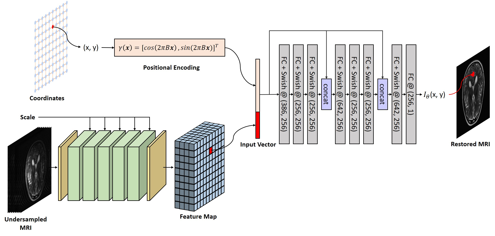

# Generalized_INR  
The pytorch implementation of our paper ["Generalized Implicit Neural Representation for MRI Parallel Imaging Reconstruction"](https://arxiv.org/abs/2309.06067)



# Requirements  
python = 3.8  
torch = 1.8.1  
numpy = 1.21.1  

# Dataset Preparation 

# Run
```bash

```
```bash

```
```bash

```
```bash

```
```bash

```

# Citation  
If ypu find this repository helpful in your work, please cite:
```bash

```

# Reference
This repository refers to:  

Generalized Autocalibrating Partially Parallel Acquisitions (GRAPPA) [[code](https://github.com/mckib2/pygrappa)] and [[paper](https://onlinelibrary.wiley.com/doi/full/10.1002/mrm.10171)]  

Scan‐specific Robust Artificial‐Neural‐Networks for K‐space Interpolation (RAKI) Reconstruction: Database‐free Deep Learning for Fast Imaging [[code](https://github.com/zczam/RAKI)] and [[paper](https://onlinelibrary.wiley.com/doi/full/10.1002/mrm.27420)]  

Residual RAKI: A Hybrid Linear and Non-linear Approach for Scan-specific K-space Deep Learning [[code](https://github.com/zczam/rRAKI)] and [[paper](https://doi.org/10.1016/j.neuroimage.2022.119248)]  

ReconFormer: Accelerated MRI Reconstruction Using Recurrent Transformer [[code](https://github.com/guopengf/ReconFormer)] and [[paper](https://ieeexplore.ieee.org/document/10251064)]  
